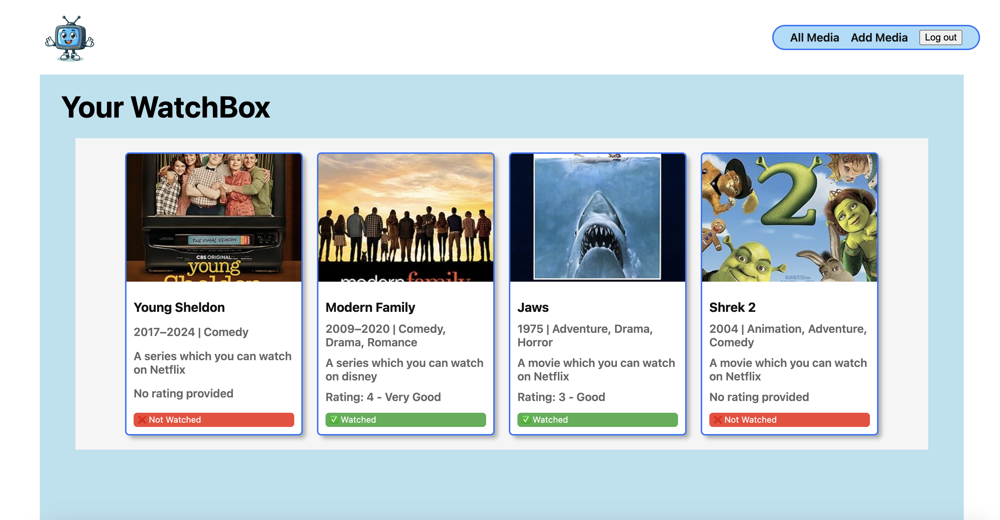

## WatchBox

**WatchBox** is a Python-Django-PostgreSQL web application that allows users to keep track of their favorite shows and movies. Users can add media, rate them, and leave reviews & update (CRUD) It provides a clean and organized interface to manage and browse a personalized collection. 

##  Features & Functionality

- **Authentication:** Secure login and signup using Django's auth system.
- **Add and Manage Media:** Create, update, and delete media entries.
- **Rate and Review:** Users can leave ratings and reviews for each media.
- **Watched Status:** Mark media as watched or unwatched
- **Organized Collection:** View all media in a grid layout with detailed pages.
- **Responsive Design:** Works well on mobile and desktop devices.
---
## Tech Stack
- **Frontend:** HTML, CSS, Django Template Language (DTL)
- **Backend:** Django, Python
- **Database:** PostgreSQL
- **Environment Management:** pipenv
- **Styling:** Custom CSS with a focus on a clean and modern UI
- **CRUD:** Full crud functionality is available in this app
---
### Timeframe & Working Team
We worked in a group of three on this project. Having Just one week to design write test & deploy the app.
### Instructions on how to use the WatchBox app
The WatchBox App is designed for TV/film enthusiasts who want to keep track of their favourite films and shows.
It offers a convenient way to manage your watchlist and stay organized using APIs
Anytime you watch a movie or show that you really enjoy, you can add it to the WatchBox App for future reference.
You can sign up for a free account and start your media list by entering the title, release year, platform (where it can be watched), and a personal rating if you've already seen it. Once on an item's detail page, you can also add reviews and read what others have to say.
You are able to manage your watchlist by adding new movies, editing information about movies already in the list, and deleting any movies you no longer wish to keep. Additionally, you can mark movies as watched to help you track your progress.
Get started now and never lose track of your favourite films again! 
## Deployment Link
---
## Timeline of Creation
## Python and Django Setup
1) Installed Python and set up a Django environment to kickstart the project.
Configured essential settings and prepared the development environment.
Database Creation
2) Designed and created the database using Django's ORM.
Defined models for Media, Reviews, and Users to organize data efficiently.
3) Generated and applied migrations to sync models with the database seamlessly.
Ensured all tables and relationships were created without issues.
4) Planned a user-friendly architecture for the app with a focus on intuitive navigation.
Built out CRUD  operations for managing movies and reviews effortlessly.
5) Integrated external APIs to fetch movie data, making the app more dynamic and engaging.
Rigorously tested each feature to ensure a smooth user experience.
Added CSS styles for a clean and modern interface, making it enjoyable to navigate.
## Authentication for Security
Implemented authentication to keep user data secure and private.
Ensured only authorized users can add, edit, or delete moedia entries.
## Challenges
As a team we collaborated smoothly with frequent communication and well laid out personal responsibilities. 
The project highlighted the importance of using clear and consistent names for GitHub branches and writing meaningful commit messages when working as part of a team. It also demonstrated the benefits of keeping pull requests small and focussed.
## Wins & Learning

As this was our final project, we experienced growth both technically and as a team. We learned the value of mutual respect, collaboration, and the power of shared creativity. Working together, we were able to combine our unique skills and perspectives, which led to innovative solutions and a much richer app experience.
In the end, not only did we build an app that we’re proud of, but we also strengthened our ability to work as a cohesive unit, ready to tackle even bigger projects in the future!

## Technologies used:
Python, Django, PostgreSQL, DTL, HTML, CSS, Markdown, GitHub.

## Room for Improvement
1) Ability to display a separate 'to-watch' list of all un-watched media
2) Ability to edit existing reviews
3) Add family user experience and enhan=ced community features